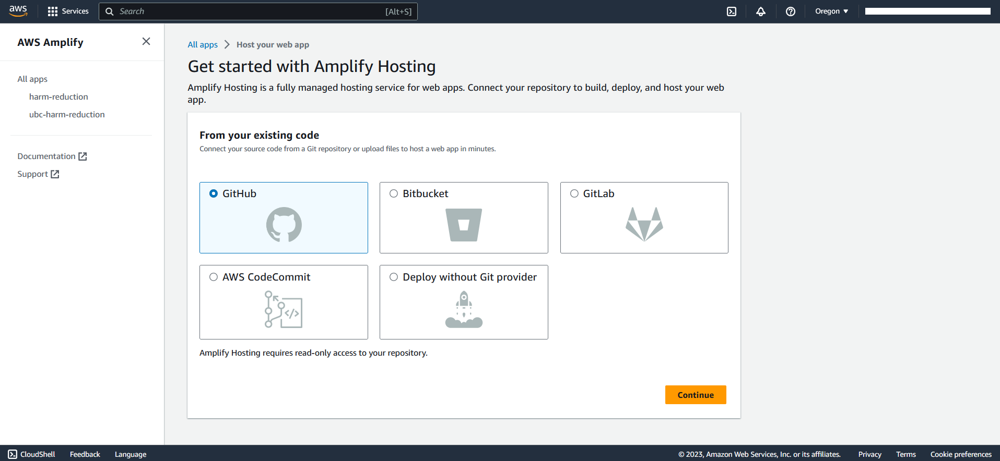
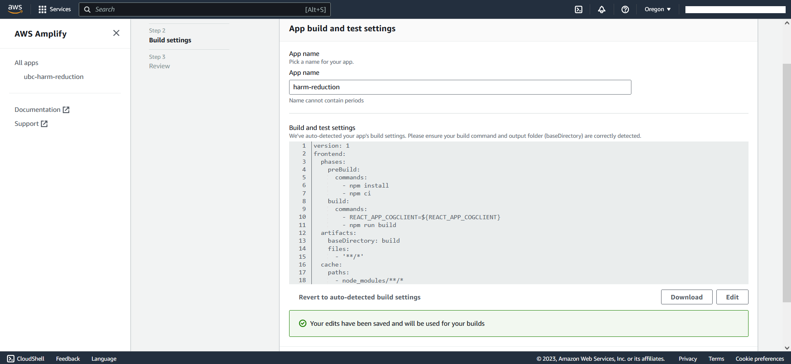
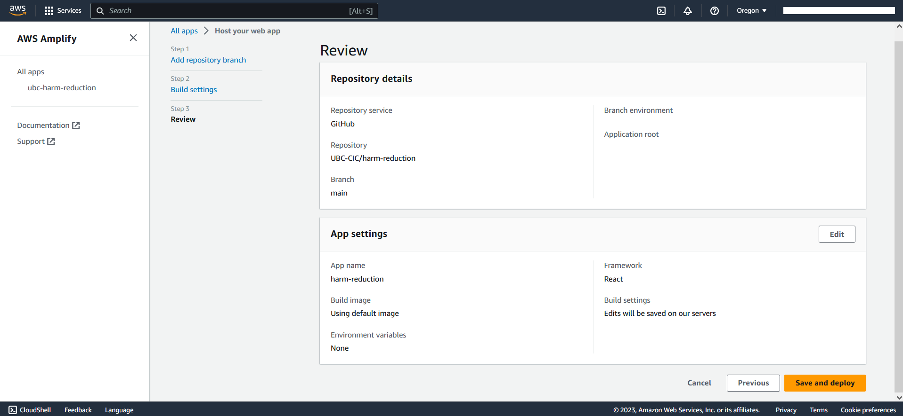
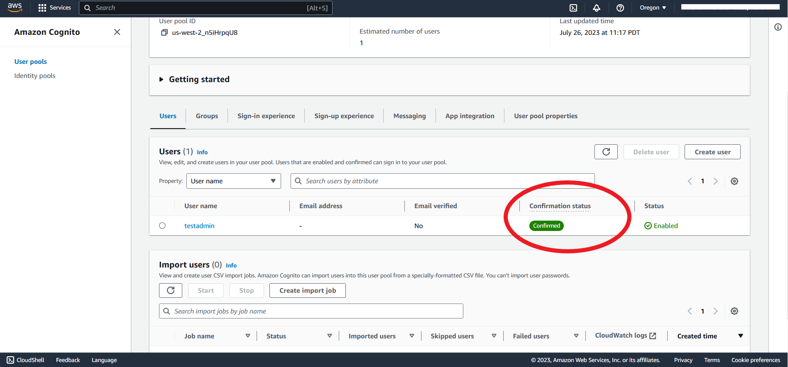
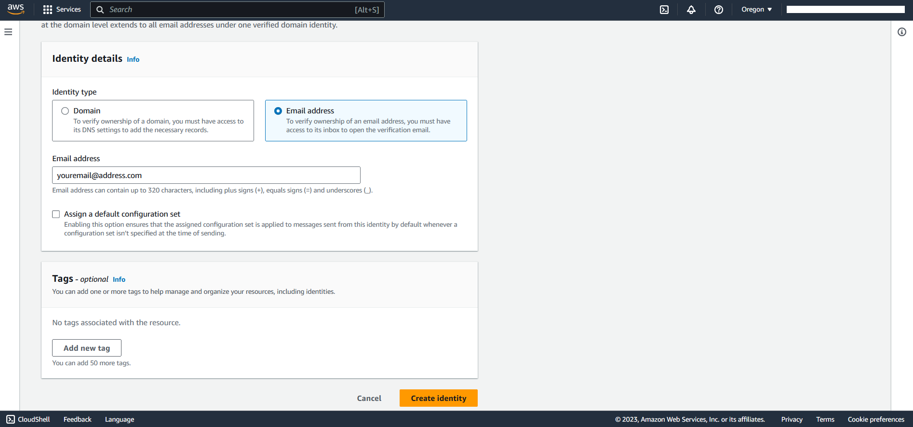
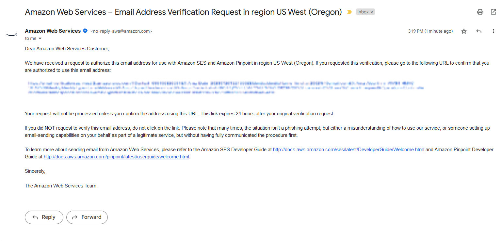
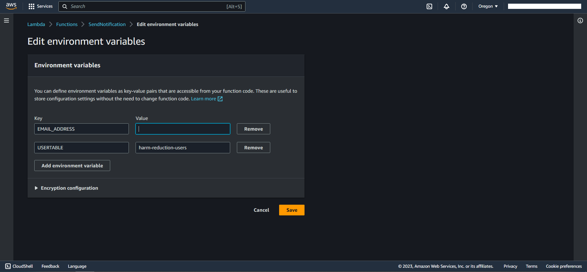

# Deployment Guide

## Requirements

Before you deploy, you must have the following in place:

* [AWS Account](https://aws.amazon.com/account/)
* [GitHub Account](https://github.com/)
* [AWS CLI](https://aws.amazon.com/cli/)
* [Node.js](https://nodejs.org/en)

# Step 1: Clone The Repository

First, clone the github repository onto your machine. To do this:

1. Create a folder on your desktop to contain the code, for example: **harm-reduction**.
2. Open terminal (or command prompt if on windows) and **cd** into the above folder.
```bash
cd harm-reduction
```
3. Clone the github repository by entering the following:

```bash
git clone https://github.com/UBC-CIC/harm-reduction.git
```

# Step 2: Frontend Deployment
The **Deploy to Amplify Console** button will take you to your AWS console to deploy the front-end solution.

[](https://console.aws.amazon.com/amplify/home#/create)

1. On the AWS console. select your region on the top right, then select Github as your code source 
2. Select the repository named `harm-reduction`, then select the branch `main`, you may be prompted to authorize amplify to access your github account

<!-- 3. In the box 'Build and test settings', make the following edits as pointed out below.   -->

3. Finally, click save and deploy to deploy the front end.

Congratulations, your front end is now deployed!

# Step 3: Backend Deployment

## Configure AWS CLI
Before deploying your backend, we must configure your command line with the proper credentials to access your AWS account.

Begin by navigating to the [IAM Console](https://us-east-1.console.aws.amazon.com/iamv2/), in the tab labled `Access Management`, select `Users`.

We will create a user with the proper authorization to deploy all of our backend resources. 

1. Click the button labeled **Add Users**.

2. Name this user `harmreduction-backenddeploy`, then click **next** to proceed.

3. Select the option **attach policies directly**, then select the policy labeled **AdministratorAccess**. Click next to proceed.

4. Finish creating the user by clicking **create user**, you should be taken back to the previous menu where all users are displayed. Click on the user you just created.

5. Select the tab `Security Credentials`, then scroll down to the box `Access Keys`, press the button **Create access key**.

6. For use case, select `Command Line Interface`, check the confirmation box, then click next to proceed. 

7. For the description tag, enter `harmreduction-backenddeploy`, then click **create access key** to proceed.

8. Click the outlined button **download .csv file**, store this file in a secure locations as it contains the credentials that provide admin-level access to your AWS account.

Next, begin configuring the AWS credentials by typing the following line in the CLI
```bash
aws configure
```

The command line interface will prompt you to enter your Access Key ID, then your Secret Access Key, both values can be found in the .csv file you downloaded in the section above. 

For your default region name, enter the region in which you are deploying your project. As for the default output format, press enter to leave it as the default value (None).

## Deploy Backend 
Once the AWS CLI has been configured with the credentials, navigate to the directory named 'cdk' 
```bash
cd cdk
```
The 'cdk' directory contains the python files that describe how the AWS resources should be deployed using the CDK. 

Subdirectories under the directory '/cdk/lambda' each contain the code for the lambda functions that make up the majority of the backend

Run the following commands in the CLI to install the dependencies required for the CDK deployment
```bash
npm install -g aws-cdk
```

The next two commands will provision resources required to deploy the full stack (backend), and begin the deployment process.
```bash
cdk bootstrap
cdk deploy
```
## Delete / Cleanup
In order to delete the stack deployed in the step above, run the following command
```bash
cdk destroy
```

## Output Values
Once the cdk deployment is complete, you should see four values in the terminal under the line **Outputs**, copy these values into a text file, as they will be important in the next step of the deployment.

# Step 4: Configure Environment Variables

Now that the back end has been deployed, we can configure the environmental variables on amplify in order to point the frontend to the correct resources to access.

On the [AWS console](https://console.aws.amazon.com/console/home), Navigate back to the amplify console by entering **Amplify**. Under the App Settings heading on the left hand sidebar, click `Environment Variables`, then click `Manage variables`

Then, add the following variables

|Name|Value|
|----|-----|
|REACT_APP_AWS_REGION|paste name of your AWS region|
|REACT_APP_DB_API_URL|paste name of the DB API url here|
|REACT_APP_OTP_API_URL|paste name of the OTP API url here|
|REACT_APP_COGCLIENT|paste CognitoClientID here|
|REACT_APP_API_KEY|paste ApiKeyOutput here|

Once you have added the variables, your screen should look something like the image below, click save to save your changes


Finally, go back to the tab labled `harm reduction`, under the `hosting environments` tab, select the deployment named `main`. Click the button **Redeploy this version** to allow for your changes to take place.

# Step 5: Configure Admin User & Admin Email

Now the web app has been deployed, we will configure the admin user, and the email from which notifications will be sent to the user. The admin user will be provisioned through cognito, and the admin email address will be verified through SES.

## Provision Admin User
An **admin user** is needed in order to access the admin table feature, more information on this feature can be found in the [user guide](./docs/userguide.md). As the AWS user who deploys this project, you can create as many **admin users** as needed.

First, go to the `cognito` console, ensure you are in the region in which your back end was deployed, you should see a user pool named **harmreduction-adminpool**

Enter the user pool by clicking on the name, then scroll down to the `users` section and click the button labeled `create user`.

Select the options `don't send an invitation` and `generate a password`, and enter the desired username for your admin user. Then click **create user** to create the user.


To finalize the creation of this user, we will use AWS CLI to set a permanent password for this user. Listed below are the password requirements for a permanent password, once you have a permanent password for the user, it is recommended you keep this infromation in a secure location.
```
password must:
    - be 8 characters or more in length
    - contain at least one lower case character
    - contain at least one upper case character
    - contain at least one number
    - contain at least one special character
```

Copy the `userpool id` found in the box labeled `user pool overview`, this value will be used in the step below.

Then, in the same command line where you executed `aws configure` during Step 3, enter the command shown below to set a permanent password for your user.

```bash
aws cognito-idp admin-set-user-password --user-pool-id "PASTE_USER_POOL_ID_HERE" --username "PASTE_USERNAME_HERE" --password "ENTER_NEW_PASSWORD_HERE" --permanent
```

To check if the password has been successfully set, navigate back to the `cognito console`, the user that was created should appear like the image below.


## Set Administrator Email
In order to send email notifications to users and lab admins, we must set up and verify an email address to send emails **from**.

First, to verify the email address, go to the [SES console](https://us-west-2.console.aws.amazon.com/ses/). Again, please ensure the region displayed in the top right of the screen is the region in which you have deployed the project.

Under the `configuration` tab on the left, click on the `verified identities` tab, then click the `create identity` button on the right side of the screen.

Select the option `email address`, and enter your email of choice in the box labeled `email address`. Your screen should appear like the image below. Click **create identity** to finish.
 

Navigate to your email inbox, you should have received an email from Amazon Web Services, click on the blue link to verify your email address.


The link should take you to a page that confirms your email has been verified, no further action is required on that page.

Then, navigate to the [Lambda console](https://us-west-2.console.aws.amazon.com/lambda), once again, ensure the region shown at the top right of the screen is the region in which your app is deployed. Click on the tab labeled `function`, then take note of two functions, one should contained the name **'otpapihandler'**, the other should contain the name **'sendnotif'**. We will configure these two lambda functions to user your verified email address with the following steps.

1. Click on the function name to open it and navigate to the tab labeled `configuration`. Then, in the bar that opens on the left, select the tab `environment variables` and click on the button **edit**.

2. In the page that opens, for `Key`, type in `EMAIL_ADDRESS`, and for `Value`, type in the email verified in the step above. The screen should appear like so: 

3. Click save to save your changes

Follow the 3 steps listed for both of the functions. If at anytime you wish to change the email address, repeat this section with the new email address.

# Step 6: Request Production Access in SES and SNS

By default, AWS will limit your access to SES and SNS services to prevent spam and unrestricting spending, as each text/email has an associated cost. For this project, we will want to gain production access in order to be able to send notification to any user that opts in for text/email notification.

## Production Access For SES

Begin by navigating to the [SES Console](https://us-west-2.console.aws.amazon.com/ses/), as usual, ensure the region indicated in the top right is the region in which the app is deployed.

A dialogue should be seen at the top of the screen that reads: **Your Amazon SES account is in the sandbox in [AWS REGION]**. Click the button on the right side of this box labeled: **Request Production Access**

On the subsequent page, take the following action:

1. Check the box labeled **transactional**

2. For website URL, enter the URL of your amplify deployment. This URL can be found on the [Amplify console](https://us-west-2.console.aws.amazon.com/amplify/) under `Harm Reduction >> Hosting Environments >> main`

3. Paste the following text into the box labeled `use case description` 
```
This web application is a sample-tracking application, users can query for a sample given a specific sample-id, a user can then choose to associate their email to a sample, only one email can be associated with a sample, a text will be sent to a sample's associated email when the status of a sample changes.

Two types of emails will be sent through the application:
    OTP -> this is for verifying the email address a user provides, it is rate limited so a user can only request for a new OTP text every 5 mins 

    Status Update -> a status update will be sent to a user in the form of an email if there is a verified email address associated with the user, a status update is sent when the sample completes processing. Once this status update is sent, the email is removed from the mailing list. 

Assuming the rate of 100 users/month, an estimated maximum of 10 emails will be sent per day

One recipient is expected to be sent 3-4 emails over the course of their time interacting with the application

An invalid email address will result in no email being sent

There is no option to unsubscribe, but an authentication process ensures subscription is intentional
```
4. In the box `additional contacts`, add any emails you may wish to receive notifications on the status of this request for production access.

5. Finally, check the box for terms and conditions, and click the button **submit request**

## Production Access for SNS

Begin by navigating to the [SNS Console](https://us-west-2.console.aws.amazon.com/sns/), ensure that the region in the top right is the region in which the app is deployed. In the tab on the left, select `Test Messaging (SMS)`.

A box labeled `Account Information` should include the dialogue that reads: **This account is in the SMS sandbox in [AWS REGION]**. Click the button on the right side of this box labeled: **Exit SMS Sandbox**.

On the subsequent page, take the following actions:

1. For `limit type`, select **SNS Text Messaging**

2. For the link to site/app which will be sending text messages, enter the URL of your amplify deployment. This URL can be found on the [Amplify console](https://us-west-2.console.aws.amazon.com/amplify/) under `Harm Reduction >> Hosting Environments >> main`

3. For `What type of messages do you plan to send`, select **transactional**

4. For `Which AWS Region you will be sending messages from`, select the region in which your application is deployed in

5. For `Which countries do you plan to send messages to`, fill according to the use case of your application

6. For `How do your customers opt in to receive messages from you`, paste in the following sentence: 
``` 
Users can opt in to receive messages on the web app. Users who choose to opt in will receive an OTP message to verify their phone number, this process is rate limited so a user cannot spam themselves with OTP messages.
```
7. For `Please provide the message template that you plan to use to send messages`, leave the box empty

8. In the box `Requests`, you will only need to make 1 request. For `Region`, select the region in which your application is deployed.

9. For `Resource Type`, select **General Limits**

10. For `Limit`, select **Exit SMS Sandbox**

11. For `New Limit Value`, enter **100**, this value can be changed at a later date.

12. In the box `Case Description`, paste the following text:
```
This web application is a sample-tracking application, users can query for a sample given a specific sample-id, a user can then choose to associate their phone number to a sample, only one phone number can be associated with a sample, a text will be sent to a sample's associated phone number when the status of a sample changes.

Two types of messages will be sent:
    OTP -> this is for verifying the phone number a user provides, its currently rate limited so a user cannot spam themselves with OTP messages
    
    Status update-> a status update will be sent to a user in the form of an text if there is a verified phone number associated with the user, a status update is sent when the sample completes processing. Once this status update is sent, the phone number is removed from the texting list.

Assuming the rate of 100 users/month, an estimated maximum of 10 texts will be sent per day

One recipient is expected to be sent 3-4 texts over the course of their time interacting with the application

An invalid phone number will result in no text being sent

There is no option to unsubscribe, but an authentication process ensures subscription is intentional

Production access is necessary to be able to send texts to any phone number and not just the 10 verified phone numbers.
```

## Viewing Support Cases

After submitting the requests for production access, the status of these requests can be viewed at the [AWS Support Center](https://support.console.aws.amazon.com/support/). Ensure the region on the top right is the region in which the app is deployed. Go to the section `your support cases` to view your support cases.

## Adding Sample Data to API endpoint

Below is an example cURL command that can be used to create a sample item in the backend. Please use the DB API endpoint you obtained during Deployment. 

```
curl -X POST -H "Content-Type: application/json" -H "x-api-key: <API_KEY>" -d '{"sample-id": "ABC123", "color": "White", "date-received": "2023-06-01", "expected-content": "Cocaine","is-used": "True", "location": "Vancouver, BC", "notes": "N/A", "status": "Manual Testing Required", "test-results": "Cocaine 95%, Uncertain Match 5%", "testing-method": "HPLC"}' <DB_API_URL>samples?tableName=harm-reduction-samples
```

Data sent through the API should be organized using the following database schema: 


An example of a JSON object sent via the API is shown below: 

```
{
    "sample-id": "A1B2C3",
    "color": "White",
    "date-received": "2023-06-01",
    "expected-content": "Methamphetamine",
    "is-used": "N/A",
    "location": "Vancouver, BC",
    "notes": "N/A",
    "status": "Pending",
    "test-results": "Methamphetamine 90-95%, Fentanyl 5-10%",
    "testing-method": "HPLC"
},
```

# Optional: Configure Domain Name
To congifure a custom domain name, please refer to the following [AWS documentation](https://docs.aws.amazon.com/amplify/latest/userguide/custom-domains.html)
