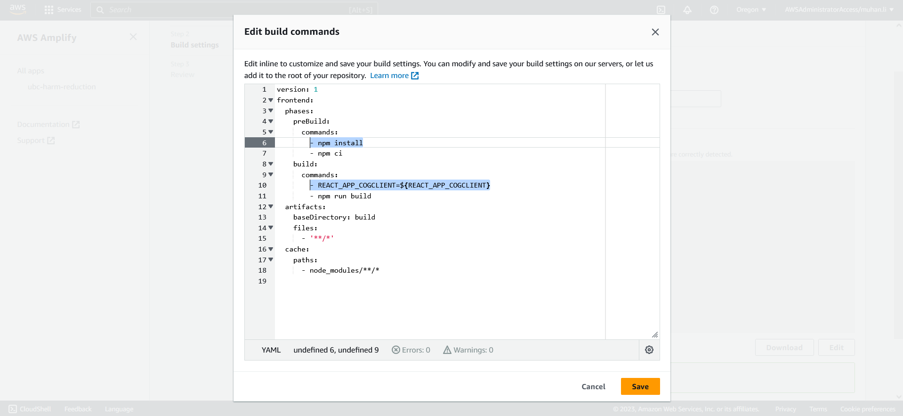
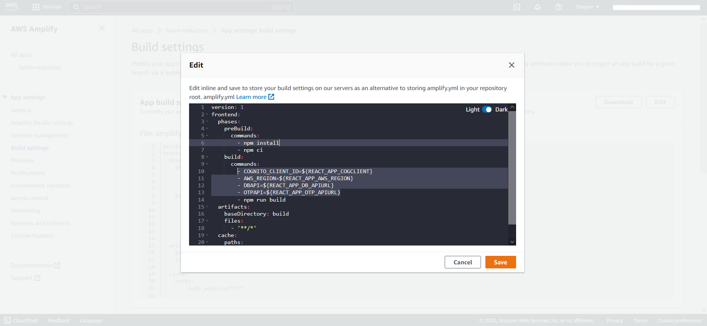
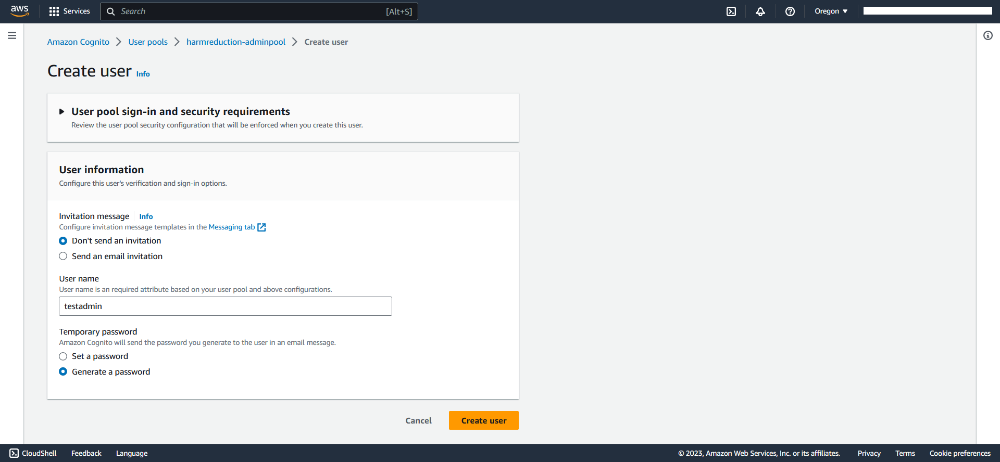

# Deployment Guide

## Requirements

Before you deploy, you must have the following in place:

* [AWS Account](https://aws.amazon.com/account/)
* [GitHub Account](https://github.com/)
* [AWS CLI](https://aws.amazon.com/cli/)

## Step 1: Clone The Repository

First, clone the github repository onto your machine. To do this:

1. Create a folder on your desktop to contain the code, for example: **harm-reduction**.
2. Open terminal (or command prompt if on windows) and **cd** into the above folder.
```bash
cd harm-reduction
```
3. Clone the github repository by entering the following:

```bash
git clone https://github.com/UBC-CIC/harm-reduction.git
```

## Step 2: Frontend Deployment
The **Deploy to Amplify Console** button will take you to your AWS console to deploy the front-end solution.

[](https://console.aws.amazon.com/amplify/home#/create)

1. On the AWS console. select your region on the top right, then select Github as your code source 
2. Select the repository named `harm-reduction`, then select the branch `main`, you may be prompted to authorize amplify to access your github account

<!-- 3. In the box 'Build and test settings', make the following edits as pointed out below.   -->

3. Finally, click save and deploy to deploy the front end.

Congratulations, your front end is now deployed!

# Step 3: Backend Deployment

## Configure AWS CLI
Begin by configuring the AWS credentials by typing the following line in the CLI
```bash
aws configure
```
Please note that it is expected for your account to have administrator access for the steps in this deployment guide

## Deploy Backend 
Once the AWS CLI has been configured with the credentials, navigate to the directory named 'cdk' 
```bash
cd cdk
```
The 'cdk' directory contains the python files that describe how the AWS resources should be deployed using the CDK. 

Subdirectories under the directory '/cdk/lambda' each contain the code for the lambda functions that make up the majority of the backend

Run the following commands in the CLI to install the dependencies required for the CDK deployment
```bash
npm install -g aws-cdk
pip install -r requirements.txt
```

The next two commands will provision resources required to deploy the full stack (backend), and begin the deployment process.
```bash
cdk bootstrap
cdk deploy
```
## Delete / Cleanup
In order to delete the stack deployed in the step above, run the following command
```bash
cdk destroy
```

## Output Values
Once the cdk deployment is complete, you should see four values in the terminal under the line **Outputs**, copy these values into a text file, as they will be important in the next step of the deployment.

# Step 4: Configure Environmental Variables

Now that the back end has been deployed, we can configure the environmental variables on amplify in order to point the frontend to the correct resources to access.

On the [AWS console](https://console.aws.amazon.com/console/home), Navigate back to the amplify console by entering **Amplify**. Under the App Settings heading on the left hand sidebar, click `Environment Variables`, then click `Manage variables`

Then, add the following variables

|Name|Value|
|----|-----|
|REACT_APP_AWS_REGION|paste name of your AWS region|
|REACT_APP_DB_APIURL|paste name of the DB API url here|
|REACT_APP_OTP_APIURL|paste name of the OTP API url here|
|REACT_APP_COGCLIENT|paste client ID of cognito userpool app client here|

Once you have added the variables, your screen should look something like the image below, click save to save your changes


Navigate to the `build settings` section in the left sidebar. In the upper right corner of the box labeled `app build specification`, click edit and add the highlighted lines to the build settings


Finally, go back to the tab labled `harm reduction`, under the `hosting environments` tab, select the deployment named `main`. Click the button **Redeploy this version** to allow for your changes to take place.

# Step 5: Configure Admin Profile & Email

Now the web app has been deployed, we will configure the admin user, and the email from which notifications will be sent to the user. The admin user will be provisioned through cognito, and the admin email address will be verified through SES.

## Provision Admin User
An **admin user** is needed in order to access the admin table feature, more information on this feature can be found in the [user guide](./docs/userguide.md). As the AWS user who deploys this project, you can create as many **admin users** as needed.

First, go to the `cognito` console, ensure you are in the region in which your back end was deployed, you should see a user pool named **harmreduction-adminpool**

Enter the user pool by clicking on the name, then scroll down to the `users` section and click the button labeled `create user`.

Select the options `don't send an invitation` and `generate a password`, and enter the desired username for your admin user. Then click **create user** to create the user.


To finalize the creation of this user, we will use AWS CLI to set a permanent password for this user. Listed below are the password requirements for a permanent password, once you have a permanent password for the user, it is recommended you keep this infromation in a secure location.
```
password must:
    - be 8 characters or more in length
    - contain at least one lower case character
    - contain at least one upper case character
    - contain at least one number
    - contain at least one special character
```

Copy the `userpool id` found in the box labeled `user pool overview`, this value will be used in the step below. Then, navigate to the AWS [Cloudshell](https://us-west-2.console.aws.amazon.com/cloudshell), ensure that the region displayed in the top right is the region in which your app is deployed.

Enter the command shown below in the command line to set a permanent password for your user

```bash
aws cognito-idp admin-set-user-password --user-pool-id "PASTE_USER_POOL_ID_HERE" --username "PASTE_USERNAME_HERE" --password "ENTER_NEW_PASSWORD_HERE" --permanent
```

To check if the password has been successfully set, navigate back to the `cognito console`, the user that was created should appear like the image below.


## Set Administrator Email
