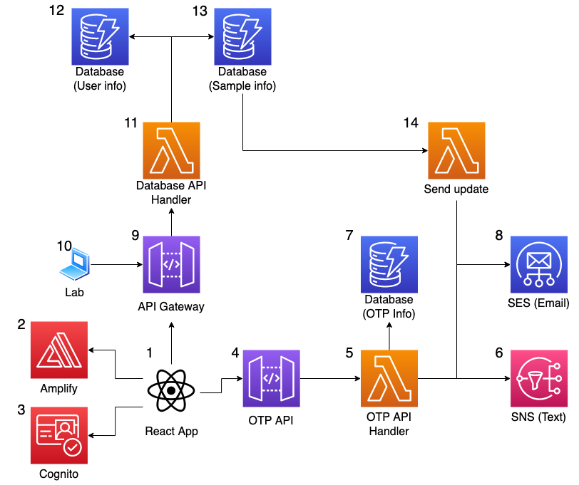

# Architecture Diagram

## Description 
| ID | Resource Name                 | Description |
| -- | ----------------------------- | ----------- | 
| 1  | React App               | The web app through which an user will interact with the video streaming and recording functionalities
| 2  | Amplify                       | The scripts that make up the react front end is hosted using AWS Amplify
| 3  | Cognito                       | Cognito is used to allocate information for admin users. Admin users will be able to use their credentials to log into the admin page. Admin users must be manually allocated by the system administrator through the AWS Console
| 4  | API Gateway (OTP)             | API Gateway for OTP operations will accept only POST requests. Combined with the 'action' key in the OTP, these POST requests will either trigger the 'send' OTP command or the 'verify' OTP command. This API Gateway is linked to a lambda function (5) that handles the requests made to the API Gateway.
| 5  | Lambda (OTP API Handler)      | This lambda function contains the code for sending or verifying OTPs. This function interacts with SNS(6) or SES(8) in order to send an OTP to a user's preferred contact. In order to verify an entered OTP is the correct one, this function will check the entered OTP against the key, which is stored in a DyanmoDB table(7).
| 6  | Simple Notification Service   | An AWS service that provides the ability to send texts to any phone number. Users must make a request to AWS support to gain full production access of this service, instructions on how to make this request is included in the deployment guide
| 7  | DynamoDB (OTP Info)           | 
| 8  | Simple Email Service          | 
| 9  | API Gateway (Database)        |  
| 10 | Lab (Python Client)           | 
| 11 | Lambda (Database API Handler) | 
| 12 | DynamoDB (User Info)          | 
| 13 | DynamoDB (Sample Info)        | 
| 14 | Lambda (Send Notifications)   | 
---