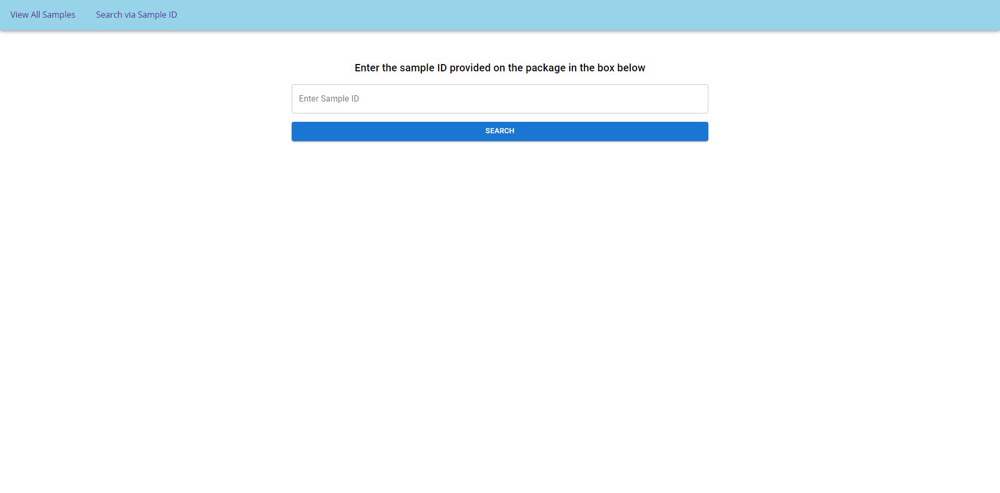
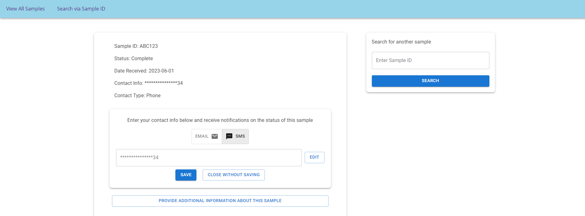
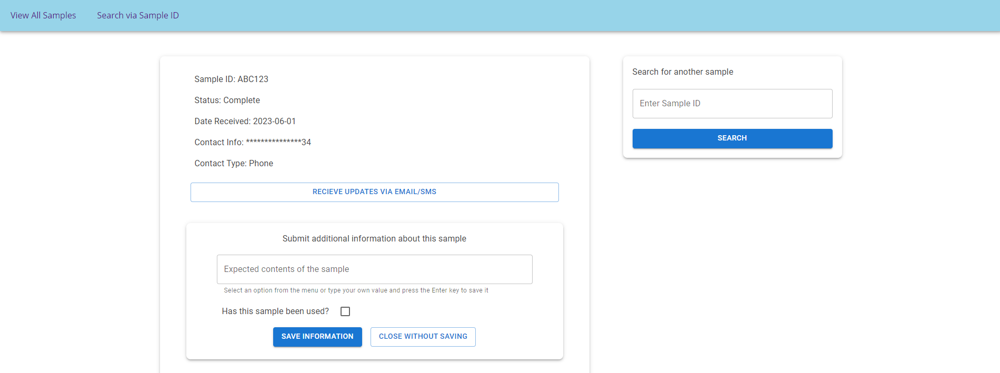
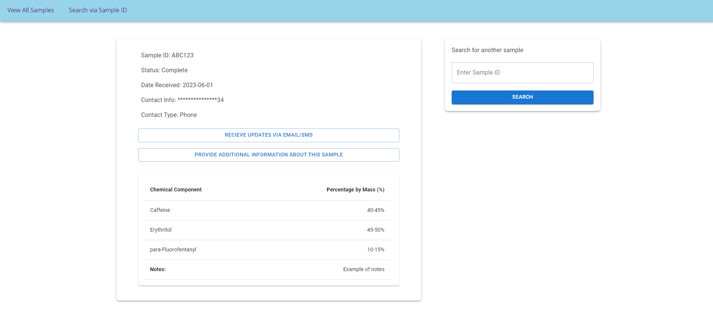
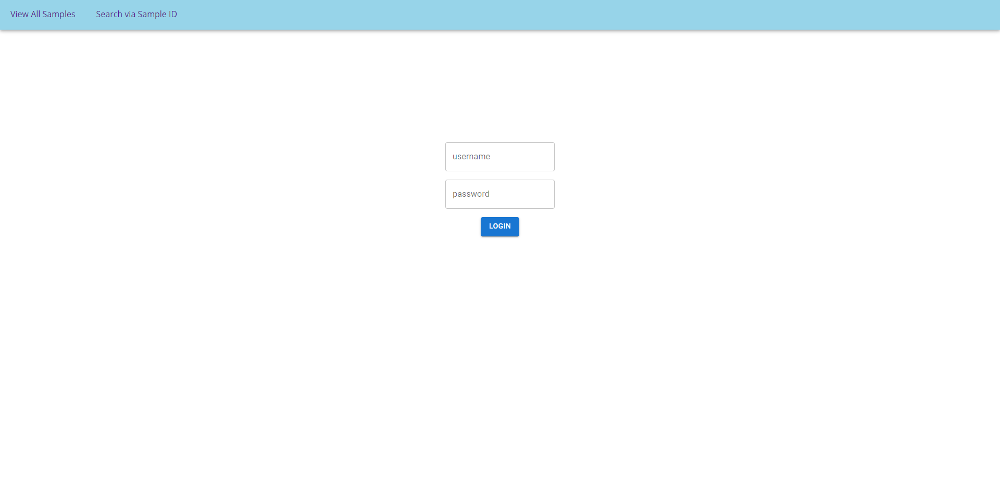

# User Guide

**Before Continuing with this User Guide, please make sure you have deployed the frontend and backend stacks.**

- [Deployment Guides](./DeploymentGuide.md)

| Index | Description |
| :---- | :---------- |
| [Home Page](#home-page) | Landing page for users |
| [Public Table Page](#public-table-page) | Viewing all sample available to the public |
| [Individual Sample Page](#individual-sample-page) | Viewing a sample specified by sample ID |
| [Admin Login Page](#admin-login-page) | Login page for lab admin |
| [Admin Table Page](#admin-table-page) | Table with info privy only to the admin |
|||

## Home Page

The home page serves as a landing page for users. It consists of a static section and a navbar with three links: home page, public samples page, specific sample page. A throuhgout description of the other two pages are available below.

### 1. Contents

The contents of the page can be edited in the github repo. However, there is no text editor available to manage this content, it is recommended to have some react/html experience if you intend to make edits to this section.

## Public Table Page

The Public Table Page is a table that displays all the samples that have been through the drug-testing cycle. It does not display any sensitive information as this table can be accessed by anyone on the website.

### 1. Public Table

The table displays samples in three columns of information: date sample was received by the lab, expected contents of the sample, and test results if they're available. The table can be searched/filtered via these columns.

### 2. Search Field

The three search field that are available match the three columns in the table. Each of them will filter the table by the input. For example: entering 'Heroin' in the expected contents will cause the table to show only samples with 'Heroin' in the expected contents column.

## Individual Sample Page

The individual samples page is for a user who has a specific sample ID. In the context of drug testing offered by the Hein Lab, a user will typically receive this sample ID from the sample submission package offered by the Lab. For other projects, how the user obtains their sample ID may vary.

### 1. Search Field

A user will enter their sample ID, then the search button is available to kickstart the query of the database. An invalid sample ID will cause an error message to display. The sample ID is not case sensitive, entries will be automatically converted to upper case.

### 2. Opt in for Email/SMS Notification

A button is available, which opens a box upon click to collect a user's contact information. The button toggles whether the entered contact info is an email address or phone number. After clicking the save button, invalid contact info will cause an error message to display, valid contact details will cause an OTP (One Time Password) to be sent to the contact. This OTP then must be entered in the text field to verify the user has entered the correct and desired contact info.

### 3. Entering Additional Metadata

A button that opens a box to prompt for additional information from a user. This box will open automatically if the user has yet to provide details on the expected contents about the sample or whether the sample has already been used. A checkbox is available to show whether a user has already used the sample, and the text field is for the user to enter what the expected contents of the sample is.

### 4. Sample Contents Table

If the status of the sample is 'Complete', a table will show, displaying the test results of the sample. In the left column are the chemical components of the sample, and in the right column are the percentage of these chemical components sorted by mass. The last row of the table displays any additional notes which may have been left by the lab admin for the user.

## Admin Login Page

The admin login page is an unlisted link which is available only to the lab admins, this page leads to the admin table.

### 1. Login Field

This is a simple login field that allows for the lab admin to enter the next page. This user must be allocated through the AWS Console by the system administrator. It is intentionally designed to ensure only someone with the correct credentials can access the next page.

## Admin Table Page

The admin table page is similar to the public samples page, but this table will display all the available information regarding each sample. This page does not contain sensitive information such as user contact information.

### 1. Admin Table

The table contains 10 columns. Sample ID, expected contents, test results, status, date received, notes, if the sample has been used, location, colour of sample, and testing method. The edit button at the right of every row allows the admin to edit any of the fields. Any edit made to this table will update the backend database accordingly.

### 2. Filters

There are 5 filters available: status, location, color, testing method, and is-used. Each filter includes a dropdown list of checkboxes, these checkboxes are generated based on the actual entrie in the table. 

### 3. Search Fields

There are 4 search fields available: sample ID, expected content, test results, and date received. These search fields work the same way as the search fields in the public samples table.